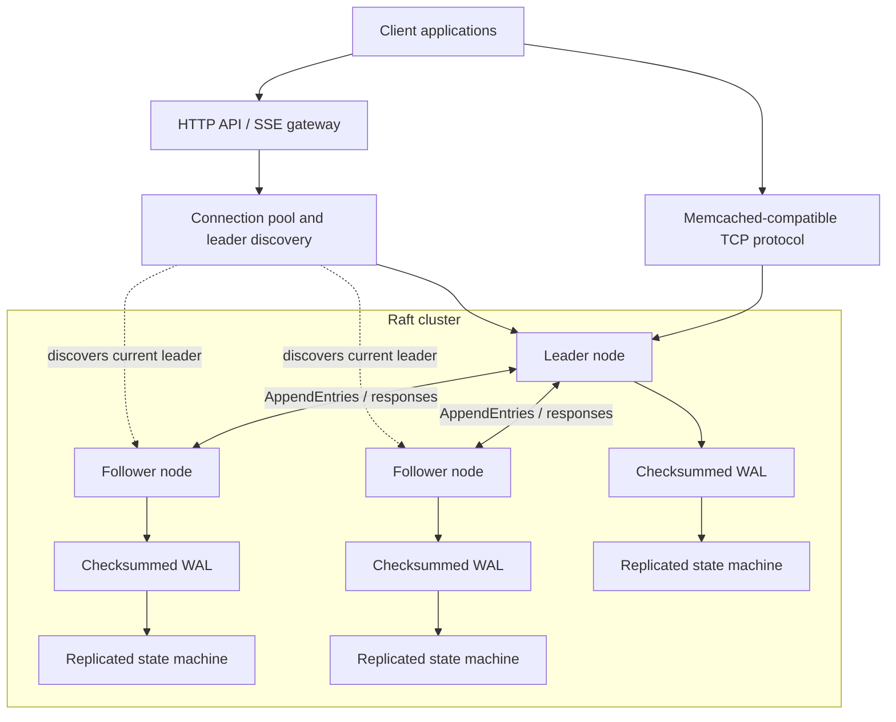

<div align="center">

# QuorumStore

### A fault-tolerant distributed key-value store engineered for durability, consistency, and recovery

[](https://openjdk.org/)
[](https://maven.apache.org/)
[](https://raft.github.io/)
[](https://github.com/memcached/memcached/wiki/Commands)
[](https://github.com/Pragati4566/QuorumStore/actions/workflows/ci.yml)
[](LICENSE)

**Replicate writes. Survive failures. Recover safely. Measure every trade-off.**

[Architecture](#architecture) · [Quickstart](#quickstart) · [Consistency model](#consistency-and-durability) · [Testing](#testing-and-failure-validation) · [Benchmarks](#performance-and-benchmarks) · [Design decisions](#design-decisions)

</div>

---

## Overview

QuorumStore is a distributed key-value store built to explore the engineering behind reliable data systems. It combines a Raft consensus implementation, a durable write-ahead log (WAL), snapshotting, recovery workflows, and client-facing TCP and HTTP interfaces in one observable system.

Unlike a CRUD-only service, QuorumStore makes the hard parts explicit: what happens when a leader disappears during a write, when a follower falls behind, when a process restarts with a partially written log, or when a client retries a request after losing the response.

### Engineering objectives

- **Correct replication:** elect one leader and replicate ordered log entries across a cluster.
- **Durable acknowledgements:** acknowledge a write only after the documented quorum and persistence conditions are met.
- **Recoverability:** restore node state from checksummed logs and snapshots after process or machine failures.
- **Explicit consistency:** provide a documented contract for linearizable reads, writes, and client retries.
- **Bounded resource use:** validate input, apply request limits, and use bounded queues and timeouts.
- **Observable behavior:** expose cluster state, replication progress, WAL activity, and recovery outcomes.
- **Reproducible performance work:** benchmark throughput and tail latency under repeatable workloads.

## At a glance

| Area | Design |
|---|---|
| Runtime | Java 21 |
| Build | Maven multi-module project |
| Consensus | Raft leader election and log replication |
| Storage | In-memory key-value state backed by a checksummed WAL |
| Recovery | WAL replay, snapshots, log compaction, follower catch-up |
| Client protocols | Memcached-compatible text protocol and HTTP REST API |
| Cluster events | Server-Sent Events (SSE) |
| Testing | Unit, integration, socket, restart, fault-injection, and chaos tests |
| Operations | Docker Compose, health checks, structured logs, metrics, CI |

## Architecture

QuorumStore separates the client gateway, consensus protocol, durable storage, and state machine so that each part can be tested and reasoned about independently.



### Core components

| Component | Responsibility |
|---|---|
| Raft node | Terms, elections, heartbeats, voting, replication, commit advancement, and leader transitions |
| Replicated log | Ordered commands, conflict resolution, log matching, and follower catch-up |
| WAL engine | Checksummed records, group commit, durable writes, recovery, and corruption detection |
| Snapshot manager | Snapshot creation, log compaction, installation, and recovery of lagging followers |
| State machine | Deterministic application of committed operations to key-value state |
| TCP protocol server | Memcached-compatible commands, parsing, request validation, and bounded connection handling |
| HTTP gateway | REST API, leader discovery, connection pooling, API errors, and SSE cluster events |
| Observability layer | Structured logs, health/readiness checks, metrics, and operational state |
| Failure test harness | Controlled node stops, restarts, latency, dropped messages, and recovery assertions |

## Key capabilities

### Consensus and replication

- Raft-based leader election with randomized election timeouts and heartbeats.
- Persistent term and vote state to prevent a restarted node from voting inconsistently.
- Log replication with per-entry conflict checks and bounded retry behavior.
- Majority-based commit advancement with explicit local-persistence conditions.
- Snapshot installation and log compaction for followers that fall behind.
- Clear handling of leader transitions and requests sent to followers.
- Membership changes validated through a quorum-safe transition procedure.

### Durable storage and recovery

- Checksummed WAL records with sequence information and corruption detection.
- Group commit to batch concurrent writes while preserving the acknowledgement contract.
- Recovery by replaying valid log records and restoring the state machine.
- Atomic snapshot publication and durable metadata updates.
- WAL segment rotation and log compaction to control disk growth.
- Explicit fail-stop behavior when the node can no longer trust its persisted state.
- Recovery tests for truncated records, interrupted writes, restarts, and lagging replicas.

### Consistency and safe retries

- Linearizable reads routed through a quorum-confirmed read path.
- Writes acknowledged only after the required replication and persistence conditions hold.
- Client request IDs and deduplication to make retry behavior explicit.
- Deterministic operation ordering across replicas.
- TTL decisions represented consistently across replication and recovery.
- Documented behavior for timeouts, leader changes, and requests whose response is lost.

### Client interfaces

- Memcached-compatible TCP operations: `set`, `add`, `replace`, `append`, `prepend`, `get`, `delete`, and `stats`.
- REST operations for reading, writing, listing, and deleting keys.
- Cluster status endpoint with node roles, terms, commit indexes, applied indexes, and replication lag.
- Server-Sent Events for live cluster-state updates.
- Consistent HTTP error mapping for missing keys, validation failures, unavailable leaders, and retryable conditions.
- Request timeouts, payload limits, and bounded resource usage.

### Operations and observability

- Docker Compose configuration for a local multi-node cluster.
- Readiness and liveness checks for nodes and the gateway.
- Structured logs with node identity, term, request ID, and operation context.
- Metrics for elections, replication lag, WAL write/fsync latency, commit progress, request latency, error rate, and recovery duration.
- Controlled failure scenarios to observe leader election and follower recovery.
- CI checks for formatting, compilation, unit tests, integration tests, and static analysis.

## Consistency and durability

QuorumStore makes its write-acknowledgement and read-consistency contracts explicit. The following table describes the intended system behavior and the conditions under which it holds.

| Situation | Expected behavior |
|---|---|
| Successful write | Acknowledged only after the configured quorum and leader-persistence requirements are satisfied |
| Leader fails before a write is committed | The operation may need to be retried; it is not reported as a successful committed write |
| Leader fails after acknowledgement | The acknowledged committed write remains recoverable while the Raft safety assumptions and durable-storage guarantees hold |
| Follower falls behind | It catches up from retained log entries or installs a snapshot |
| Process restarts | Persistent term/vote state and the WAL are replayed before the node serves normal traffic |
| Client retries a request | Request-ID deduplication prevents an already-completed operation from being applied again within the documented deduplication window |
| No leader is available | The gateway returns a retryable unavailable response instead of implying that a write succeeded |

These guarantees depend on a majority of the cluster being available for quorum operations and on the underlying storage honoring the persistence operations used by the implementation. QuorumStore is an engineering project, not a claim of formal verification or production certification.

## How a write works

1. The client sends a write to the current leader through the TCP protocol or HTTP gateway.
2. The request is validated and assigned an operation identity for deduplication.
3. The leader appends the command to its Raft log and schedules durable WAL persistence.
4. The leader replicates the entry to followers through Raft's `AppendEntries` messages.
5. The commit index advances only when the quorum and persistence requirements are satisfied.
6. Each node applies committed entries to its state machine in log order.
7. The gateway returns success only after the write satisfies the acknowledgement contract.

This path deliberately treats correctness and durability as constraints—not optional optimizations that can be removed to improve a benchmark score.

## Quickstart

### Prerequisites

- Java 21
- Maven 3.9 or newer
- Docker Engine and Docker Compose
- `curl` and a shell environment

### Build and test

```bash
git clone https://github.com/Pragati4566/QuorumStore.git
cd QuorumStore
mvn clean verify
```

The verification lifecycle compiles all modules and runs the unit and integration test suites. A failing test is treated as a defect to investigate, not a reason to bypass verification.

### Start a local cluster

```bash
docker compose -f deploy/docker-compose.yml up --build -d
docker compose -f deploy/docker-compose.yml ps
```

Check the health endpoint and cluster status:

```bash
curl -fsS http://localhost:8080/health/ready
curl -fsS http://localhost:8080/api/cluster
```

Stop the cluster:

```bash
docker compose -f deploy/docker-compose.yml down
```

> Port mappings, Compose service names, and configuration keys should stay synchronized with the deployment files in the repository.

## Use the TCP protocol

Connect to the configured leader port (the default development mapping is `11211`):

```bash
nc localhost 11211
```

Then enter a write and read:

```text
set greeting 0 0 5
hello
get greeting
```

A successful `set` returns `STORED`. A successful read returns the stored value followed by `END`. If the connected node is not the leader, the server returns a redirect/error response that identifies the current leadership state.

A non-interactive smoke test can be run with:

```bash
printf 'set greeting 0 0 5\r\nhello\r\nget greeting\r\n' | nc localhost 11211
```

## HTTP API

The HTTP gateway exposes a small API for application clients and operational tooling.

| Method | Endpoint | Purpose |
|---|---|---|
| `GET` | `/api/kv/{key}` | Read a key |
| `PUT` | `/api/kv/{key}` | Create or replace a value |
| `DELETE` | `/api/kv/{key}` | Delete a key |
| `GET` | `/api/cluster` | Inspect cluster and node state |
| `GET` | `/api/events` | Stream cluster-state events over SSE |
| `GET` | `/health/live` | Check process liveness |
| `GET` | `/health/ready` | Check whether the service is ready to handle requests |
| `GET` | `/metrics` | Scrape runtime and application metrics |

### Example requests

```bash
# Write a value
curl -i -X PUT http://localhost:8080/api/kv/greeting \
  -H 'Content-Type: text/plain' \
  --data 'hello'

# Read the value
curl -i http://localhost:8080/api/kv/greeting

# Inspect the cluster
curl -fsS http://localhost:8080/api/cluster

# Delete the value
curl -i -X DELETE http://localhost:8080/api/kv/greeting
```

The gateway uses status codes consistently: a missing key returns `404`, invalid input returns a client error, and an unavailable leader returns a retryable service error. It does not convert an uncertain write outcome into a false success response.

## Testing and failure validation

Run the full verification suite:

```bash
mvn verify
```

Run the failure and recovery suite separately:

```bash
mvn -Pchaos-tests verify
```

Run the benchmark suite:

```bash
./scripts/benchmark.sh --profile local-three-node
```

The test strategy covers behavior at multiple levels:

| Test layer | Scenarios |
|---|---|
| Unit tests | WAL framing, state-machine operations, request validation, deduplication, and protocol parsing |
| Raft tests | Elections, voting, log matching, commit advancement, and snapshot installation |
| Socket integration tests | Fragmented requests, disconnects, timeouts, and real TCP behavior |
| Durability tests | Crash during traffic, restart recovery, WAL replay, and committed-write preservation |
| Fault injection | Leader termination, follower lag, dropped/delayed messages, disk errors, and interrupted persistence |
| Gateway tests | Leader discovery, retryable errors, request validation, SSE updates, and bounded connection handling |
| Regression tests | Reproduction cases for previously fixed correctness or performance defects |
| Load tests | Concurrent clients, sustained writes, read/write mixes, and tail-latency measurements |

A test is considered meaningful when it asserts a safety or recovery property, not merely that a method returned without throwing an exception.

## Performance and benchmarks

QuorumStore includes a repeatable benchmark harness for measuring throughput, latency, resource usage, and behavior during failure. Benchmark reports should be generated from the current commit and include the command, machine configuration, Java version, node count, value size, concurrency, duration, read/write mix, and error count.

The benchmark output records:

- Operations per second for reads and writes.
- p50, p95, and p99 request latency.
- Error and timeout counts.
- CPU and memory utilization where available.
- WAL append and fsync latency.
- Replication lag and leader-recovery time.
- Results with and without the HTTP gateway.

For repeatable local measurements:

```bash
./scripts/benchmark.sh --profile local-three-node --duration 60s --clients 64
```

For a failure-under-load run:

```bash
./scripts/benchmark.sh --profile leader-failover --duration 120s --clients 32
```

The harness writes machine-readable results to `build/benchmarks/` and a summary report to `docs/benchmarks/`. Compare results only when the workload and environment are equivalent, and never present higher throughput as an improvement if it was achieved by weakening the durability or consistency contract.

## Observability

The cluster exposes state needed to diagnose replication and recovery problems:

- Current role, term, and leader identity.
- Commit index and last-applied index.
- Per-follower replication progress and lag.
- WAL queue depth, append duration, and fsync latency.
- Election count and election duration.
- Request rate, response latency, error rate, and rejected requests.
- Snapshot creation/install duration and recovery results.

Logs carry node identity, term, operation/request ID, and relevant failure context. Sensitive values are not included in routine logs.

## Configuration

Node and gateway settings are provided through configuration files and environment variables. A deployment should define, at minimum:

| Setting | Purpose |
|---|---|
| `QUORUMSTORE_NODE_ID` | Stable identity of this node |
| `QUORUMSTORE_LISTEN_ADDRESS` | Client and peer bind address |
| `QUORUMSTORE_PEERS` | Configured cluster peer addresses |
| `QUORUMSTORE_DATA_DIR` | WAL, snapshots, and persistent metadata directory |
| `QUORUMSTORE_GATEWAY_URLS` | Gateway's node connection targets |
| `QUORUMSTORE_MAX_VALUE_BYTES` | Maximum accepted value size |
| `QUORUMSTORE_REQUEST_TIMEOUT` | Upper bound for supported request operations |
| `QUORUMSTORE_METRICS_ENABLED` | Enable or disable metrics exposure |

Use the example configuration files for local development. Production deployments should restrict peer traffic to trusted networks, keep data directories persistent, and configure resource limits appropriate to the workload.

## Security and operational boundaries

- Validate command lengths, values, keys, and request metadata before allocating unbounded resources.
- Apply request timeouts, connection limits, and bounded queues to protect against slow or oversized clients.
- Keep internal peer endpoints private and restrict access to administrative endpoints.
- Configure TLS and gateway authentication when the deployment crosses a trust boundary.
- Treat disk errors and corrupted persistent state as explicit recovery events.
- Back up or export data before destructive development and chaos tests.
- Do not expose development chaos controls to public clients.

QuorumStore is intended for systems-engineering study, experimentation, and demonstrable reliability testing. Evaluate security, disaster recovery, and operational behavior thoroughly before using any build for important data.

## Design decisions and trade-offs

### Durability versus throughput

Waiting for the required persistence and quorum conditions can reduce write throughput, but acknowledging a write before the documented durability condition would weaken the system's correctness contract. Group commit reduces redundant flushes without changing the acknowledgement rule.

### Snapshots versus replay time

Snapshots and log compaction bound recovery work for long-lived clusters. Snapshot installation adds its own correctness requirements: metadata and state must correspond to the same committed position, and followers must resume replication from a consistent point.

### Linearizable reads versus local read speed

A local follower read can be faster but may be stale. QuorumStore's default consistency contract favors a quorum-confirmed read path; any weaker read mode must be explicit and documented.

### Retries versus duplicate operations

A timeout does not prove that a request failed. Request IDs and deduplication make retry semantics safer, while the retention period and storage cost of deduplication state remain explicit design choices.

### Failure testing versus happy-path testing

A distributed system must be tested when messages are delayed, nodes restart, storage operations fail, and the client loses a response. The failure harness makes these scenarios repeatable so correctness can be asserted rather than assumed.

## Repository structure

```text
QuorumStore/
├── quorumstore-core/          # Domain model and replicated state machine
├── quorumstore-raft/          # Elections, replication, terms, commit logic
├── quorumstore-storage/       # WAL, checksums, snapshots, recovery
├── quorumstore-protocol/      # Memcached-compatible TCP protocol
├── quorumstore-gateway/       # REST API, leader discovery, SSE, health
├── quorumstore-observability/ # Metrics, logging, health indicators
├── quorumstore-testkit/       # Fault injection and test utilities
├── deploy/                    # Docker Compose and example configuration
├── scripts/                   # Local development and benchmark scripts
├── docs/                      # Architecture, ADRs, and benchmark reports
├── pom.xml
├── LICENSE
└── README.md
```

## Development workflow

1. Create a focused branch for the change.
2. Add or update tests that express the intended behavior.
3. Run `mvn verify` before opening a pull request.
4. For performance changes, capture a baseline and a comparable after-run.
5. For consensus or persistence changes, run the relevant failure tests.
6. Update an architecture decision record when a change alters consistency, durability, recovery, or operational behavior.

## Further research directions

With the core replication, persistence, recovery, testing, and observability workflows in place, these are optional extensions for deeper systems experimentation:

- Compare alternative storage layouts and WAL segment policies under write-heavy workloads.
- Evaluate multi-region replication and the latency-versus-availability trade-offs it introduces.
- Explore model-based or property-based testing of consensus invariants over generated failure schedules.
- Compare snapshot thresholds and compaction strategies on large, skewed datasets.
- Study admission control and adaptive backpressure under mixed workloads.
- Evaluate online cluster upgrades and rolling-version compatibility between nodes.

## Author

**Pragati Chaudhary** · [GitHub](https://github.com/Pragati4566)

---

<div align="center">

**QuorumStore — engineering reliability into every acknowledged write.**

</div>
